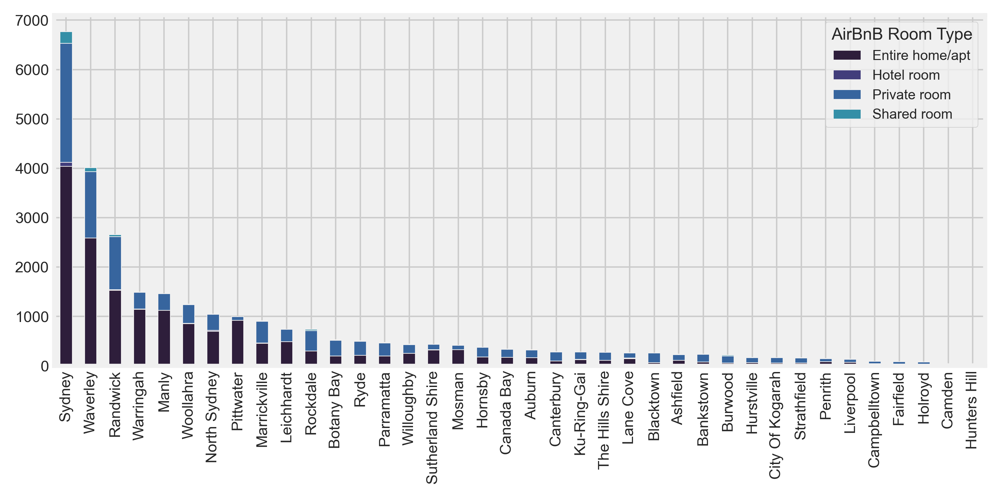
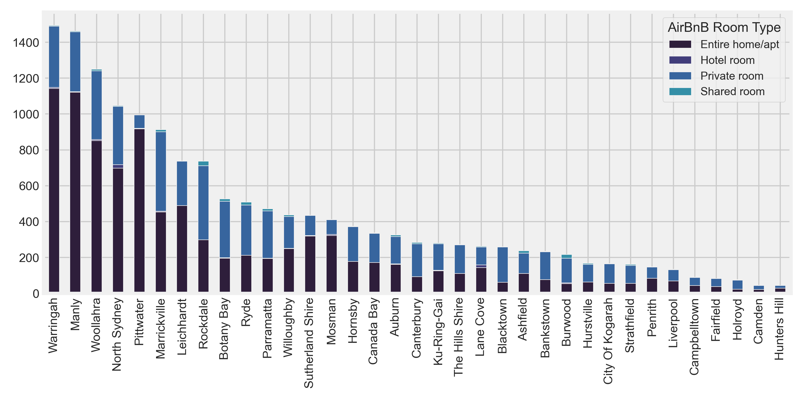
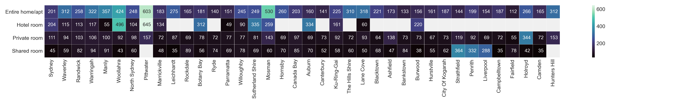
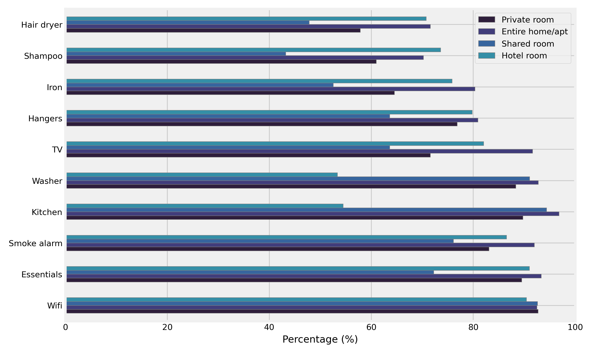

# What is your AirBnB choice for next time you are in Sydney?

NOTE: Read full blog post at Medium <https://medium.com/@humulene/what-is-your-airbnb-choice-for-next-time-you-are-in-sydney-5db6dcb201d8>

If you're travelling somewhere, the biggest challenge would be finding good, reasonably priced accommodation. Starting from the air ticket, Sydney is an expensive travel destination, particularly when compared to Asia. However, the experience you would get travelling in Australia is so unique. Sydney in particular is surrounded by a lot of beaches, national parks and tourist attractions. There is a wide variety of places you can visit within a few hours either by a vehicle or simply by using public transportation. 

AirBnB publishes its data frequently at <http://insideairbnb.com/sydney>. As of August 2020, in the middle of a global pandemic, there were 31,000 AirBnB listings in Sydney. Let's see what insights can we gain from those data.

## What neighbourhood has most listings?

Sydney city itself is surrounded by a variety of attractions. Most of these attractions are located within walking distance from the CBD or a short light trail ride. Sydney city also has a higher number of high-rise apartments as compared to its suburban areas. For all these reasons, in 2020 Sydney had the highest number of AirBnB listings followed by Waverly, Randwick, Warringah and Manly. These four neighbourhoods are very close to many popular beaches, resulting a higher rate of AirBnB listings. 

Majority of the listings are either for a whole apartment or a private room. On average apartments can accommodate 4 guests while a private room can accommodate only 2 guests.

## What is the average cost?

The next most popular question is how much these rooms cost? It is hard to comment on the accommodation prices since it purely depends on the needs and preferences of the individual/group. But, looking at the price visualisation below, a clear trend in prices can be seen. As you would naturally expect the price range increase from a shared room, which would be the lowest to a private room, then a hotel room - and an entire apartment being the most expensive. In general, Pittwater and Mosman have been highlighted as the most expensive neighbourhoods around Sydney city. 

However,the average price per person per night in Sydney is significantly higher for a hotel room (73 AUD) than for a private room (31 AUD), shared room (28) and an entire apartment (24 AUD). 

One might also wonder why a private room in Stratfield, Liverpool or Penrith costs multiple times more than the average. This price increase in these suburbs is caused by a few AirBnB listings with a higher rate of fees. 

## What amenities can you get?

Above 90 percent of the listings (except for shared rooms) have [essential amenities](https://www.airbnb.com.au/help/article/2343/what-are-essential-amenities). These include toilet paper, soap (for hands and body), one towel per guest, one pillow per guest and linen for each guest bed. This drops to 70 percent for shared rooms. Apart from the essentials, you can also get more additional amenities in an entire house/apartment or in hotel rooms; such as refrigerators, on-premises parking and microwave etc... In total, there are 176 unique amenities that have been listed so far. 

Overall, an entire house or an apartment offers the best price (per person per night) and a variety of additional amenities. Interestingly, 16 and 10 percent of entire house/apartment are available for minimum 2 and 1 night stays. It is 25 percent of the total  AirBnB listings for entire house/apartments. However, the trick here is that you can make your stay more economical, if you go in groups. on average, an entire house/apartment can accommodate up to 4 people. This makes the entire house/apartment the most popular AirBnB listing and it accounts for 60 percent of the total listings. 

The second most popular and economical accommodation would be private rooms, and accounts for 38 percent of the total listings. On average, private rooms can accommodate up to 2 people and around 90 percent of total private room listings provide their guests with all essential amenities. 

So, what type of an AirBnB would you be looking for when you are in Sydney next?

See full analysis here:  

